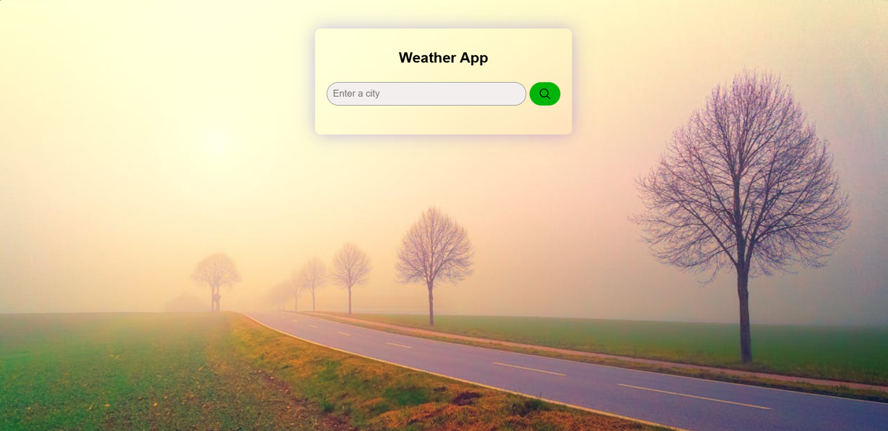

# 🌦️ Weather Application

A modern and responsive weather web application that allows users to search for any city and view real-time weather information with a clean and intuitive user interface.

## 📸 Preview



## ✨ Features

* Search weather information by city name.
* Displays current temperature, humidity, and wind speed.
* Dynamic weather icons based on weather conditions.
* Clean and modern user interface.
* Fully responsive design for mobile, tablet, and desktop devices.
* Fast and lightweight implementation using Vanilla JavaScript.

## 🛠️ Technologies Used

* **Frontend:** HTML5, CSS3, JavaScript (ES6)
* **Styling:** Custom CSS
* **Assets:** SVG Icons & Images
* **Development Tools:** Git, GitHub, VS Code

## 📂 Project Structure

```bash
Weather-App/
│
├── index.html
├── style.css
├── script.js
├── image1.jpeg
├── Preview.jpeg
├── search-outline.svg
├── README.md
└── .gitignore
```

## 🚀 How to Run Locally

### 1️⃣ Clone the Repository

```bash
git clone https://github.com/meghramb/weather-app.git
```

### 2️⃣ Navigate to the Project Directory

```bash
cd weather-app
```

### 3️⃣ Open the Application

Simply open `index.html` in your preferred web browser.

## 🎯 Future Improvements

* Add 5-day weather forecast.
* Detect user's current location automatically.
* Add dark/light mode toggle.
* Improve error handling and loading animations.
* Display additional weather details such as pressure and visibility.

## 🤝 Contributing

Contributions, issues, and feature requests are welcome!

1. Fork the repository.
2. Create a new feature branch.
3. Commit your changes.
4. Push to the branch.
5. Open a Pull Request.

## 👨‍💻 Author

**Meghram Bairwa**

Aspiring Full-Stack Developer | AI & Machine Learning Enthusiast

GitHub: https://github.com/YourUsername

LinkedIn: https://www.linkedin.com/in/meghrambairwa/

## ⭐ Support

If you found this project useful, consider giving it a ⭐ on GitHub.
